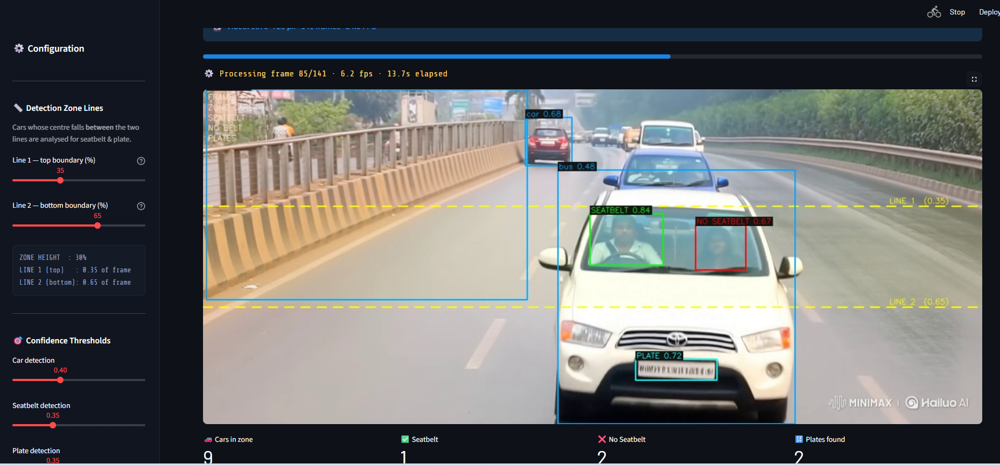

# 

<div align="center">

# 🚗 Vehicle Safety Monitor

**Automated seatbelt compliance detection & number plate recognition from traffic footage**

[](https://python.org)
[](https://ultralytics.com)
[](https://streamlit.io)
[](LICENSE)

A 3-stage YOLOv8 pipeline that detects vehicles, checks seatbelt compliance, and reads number plates — all triggered by a configurable detection zone drawn across the frame.

</div>

---

## 📋 Table of Contents

- [How It Works](#-how-it-works)
- [Project Structure](#-project-structure)
- [Setup](#-setup)
- [Usage](#-usage)
- [Model Performance](#-model-performance)
- [Datasets](#-datasets-used)
- [Bounding Box Legend](#-bounding-box-legend)
- [Tips](#-tips)

---

## ⚙️ How It Works

```
┌──────────────────────────────────────────────────────────────┐
│                        Full Video Frame                      │
│                                                              │
│  ─ ─ ─ ─ ─ ─ ─ ─ ─  LINE 1  (configurable)  ─ ─ ─ ─ ─ ─ ─ │
│                   ░░░  DETECTION ZONE  ░░░                   │
│      ┌─────────┐                                             │
│      │   CAR   │  ← Model 1 detects vehicle                  │
│      │detected │        │                                    │
│      └────┬────┘        ├──▶  Model 2  →  Seatbelt / No Belt │
│           │             └──▶  Model 3  →  Number Plate       │
│                                                              │
│  ─ ─ ─ ─ ─ ─ ─ ─ ─  LINE 2  (configurable)  ─ ─ ─ ─ ─ ─ ─ │
│                                                              │
└──────────────────────────────────────────────────────────────┘
```

| Stage | Model | Task |
|-------|-------|------|
| **1** | `car_detector.pt` | Detects all vehicles in the full frame |
| **2** | `seatbelt.pt` | Runs on each vehicle ROI — classifies `seatbelt` / `noseatbelt` |
| **3** | `best_plate.pt` | Runs on each vehicle ROI — detects `License_Plate` |

> Vehicles **outside** the zone still receive a bounding box but are **skipped** by Models 2 & 3, keeping inference fast.

---

## 📁 Project Structure

```
seatbelt-violation-detection/
├── app.py                  # Streamlit web app (recommended)
├── cli.py                  # Command-line batch runner
├── detector.py             # Core detection engine
├── requirements.txt
├── README.md
├── .gitignore
│
├── demo/
│   ├── demo.mp4            # 🎥 Demo video
│   └── banner.png          # 🖼️ Banner image
│
├── models/
│   ├── car_detector.pt     # ⬅ Car detection model
│   ├── seatbelt.pt         # ⬅ Seatbelt detection model
│   └── best_plate.pt       # ⬅ License plate model
│
├── training/               # Training notebooks & configs
```

---

## 🛠️ Setup

```bash
# 1. Clone / download this folder
cd vehicle_detection

# 2. Create a virtual environment (recommended)
python -m venv .venv
source .venv/bin/activate          # Windows: .venv\Scripts\activate

# 3. Install dependencies
pip install -r requirements.txt

# 4. Place your trained models
cp /path/to/car_detector.pt  models/car_detector.pt
cp /path/to/seatbelt.pt      models/seatbelt.pt
cp /path/to/best_plate.pt    models/best_plate.pt
```

> Class names are read **directly from each `.pt` file** at load time — nothing is hard-coded.

---

## 🚀 Usage

### Option A — Streamlit Web App *(recommended)*

```bash
streamlit run app.py
```

Open **`http://localhost:8501`** in your browser.

#### Sidebar Controls

| Control | Description |
|---------|-------------|
| **Line 1 slider** | Top boundary of detection zone (% of frame height) |
| **Line 2 slider** | Bottom boundary of detection zone (% of frame height) |
| **Car confidence** | Detection threshold for the vehicle model |
| **Seatbelt confidence** | Detection threshold for seatbelt model |
| **Plate confidence** | Detection threshold for plate model |
| **Save output** | Download the processed video when done |

---

### Option B — Command Line

```bash
# Basic — process a video with default settings
python cli.py --input traffic.mp4

# Custom detection zone (40% – 70% of frame height)
python cli.py --input traffic.mp4 --line1 0.40 --line2 0.70

# Save to a specific output path
python cli.py --input traffic.mp4 --output output/result.mp4

# Live preview without saving
python cli.py --input traffic.mp4 --preview --no-save

# Full options
python cli.py --help
```

#### CLI Arguments

| Argument | Default | Description |
|----------|---------|-------------|
| `--input` | *(required)* | Path to input video |
| `--output` | `output/result.mp4` | Path to save processed video |
| `--car` | `models/car_detector.pt` | Car detection model |
| `--seatbelt` | `models/seatbelt.pt` | Seatbelt model |
| `--plate` | `models/best_plate.pt` | Plate model |
| `--line1` | `0.35` | Top line position (0.0–1.0) |
| `--line2` | `0.65` | Bottom line position (0.0–1.0) |
| `--car-conf` | `0.40` | Car confidence threshold |
| `--sb-conf` | `0.35` | Seatbelt confidence threshold |
| `--pl-conf` | `0.35` | Plate confidence threshold |
| `--preview` | `False` | Show live OpenCV window |
| `--no-save` | `False` | Skip saving output video |

---

## 📊 Model Performance

All models trained on **Kaggle** with a **Tesla T4 GPU** using [Ultralytics YOLOv8](https://github.com/ultralytics/ultralytics).

---

### 1 · Car / Vehicle Detector — `car_detector.pt`

| Setting | Value |
|---------|-------|
| Base model | YOLOv8n |
| Epochs | 100 |
| Image size | 640 × 640 |
| Batch size | 16 |

| Metric | Score |
|--------|-------|
| Precision | 0.922 |
| Recall | 0.929 |
| **mAP@0.5** | **0.968** |
| mAP@0.5:0.95 | 0.727 |

---

### 2 · Number Plate Detector — `best_plate.pt`

| Setting | Value |
|---------|-------|
| Base model | YOLOv8n |
| Epochs | 50 |
| Image size | 640 × 640 |
| Batch size | 16 |
| Training time | ~0.975 hrs |

| Metric | Score |
|--------|-------|
| Precision | 0.987 |
| Recall | 0.967 |
| **mAP@0.5** | **0.984** |
| mAP@0.5:0.95 | 0.705 |

> Single-class model — detects `License_Plate`.

---

### 3 · Seatbelt Detector — `seatbelt.pt`

| Setting | Value |
|---------|-------|
| Base model | YOLOv8s |
| Epochs | 34 / 40 *(early stop at epoch 34, best at epoch 26)* |
| Image size | 640 × 640 |
| Batch size | 16 |
| Training time | ~1.788 hrs |

| Metric | Score |
|--------|-------|
| Precision | 0.962 |
| Recall | 0.928 |
| **mAP@0.5** | **0.969** |
| mAP@0.5:0.95 | 0.669 |

> Two-class model — detects `seatbelt` and `noseatbelt`.

---

### Overall Comparison

| Model | Base | Precision | Recall | mAP@0.5 | mAP@0.5:0.95 |
|-------|------|:---------:|:------:|:-------:|:------------:|
| Car Detector | YOLOv8n | 0.922 | 0.929 | **0.968** | 0.727 |
| Number Plate | YOLOv8n | 0.987 | 0.967 | **0.984** | 0.705 |
| Seatbelt | YOLOv8s | 0.962 | 0.928 | **0.969** | 0.669 |

---

## 📂 Datasets Used

### 1 · Car Detection — GoodConditionsTraffic
> 🔗 [Roboflow Universe — aryamans-workspace-etmwn](https://universe.roboflow.com/aryamans-workspace-etmwn/goodconditionstraffic-aouon)

| Split | Images |
|-------|--------|
| Train | 5,292 |
| Validation | 221 |

---

### 2 · Number Plate Detection — Vehicle Registration Plates
> 🔗 [Roboflow Universe — Augmented Startups](https://universe.roboflow.com/augmented-startups/vehicle-registration-plates-trudk)

| Split | Images | Instances |
|-------|--------|-----------|
| Train | 6,176 | — |
| Validation | 1,765 | 1,840 |

Classes: `License_Plate`

---

### 3 · Seatbelt Detection — Seatbelt Detection Dataset
> 🔗 [Roboflow Universe — traffic-violations](https://universe.roboflow.com/traffic-violations/seatbelt-detection-esut6)

| Split | Images | Instances |
|-------|--------|-----------|
| Train | 11,307 | — |
| Validation | 1,070 | 1,401 |
| Test | 452 | — |

Classes: `seatbelt`, `noseatbelt`

---

## 🎨 Bounding Box Legend

| Colour | Meaning |
|--------|---------|
| 🟧 **Orange** | Vehicle detected by Model 1 |
| 🟩 **Green** | Seatbelt worn ✓ |
| 🟥 **Red** | No seatbelt ✗ |
| 🟨 **Yellow** | Number plate detected |
| 〰️ **Cyan dashed** | Detection zone boundary lines |


<div align="center">

Built with [Ultralytics YOLOv8](https://ultralytics.com) · [Streamlit](https://streamlit.io) · [OpenCV](https://opencv.org)

</div>